# 🧠 NanoGPT Inference Engine — From First Principles

A deep-dive systems project that **implements 19 production inference optimizations from scratch** on top of Andrej Karpathy's NanoGPT, each paired with automated benchmark suites, a quality evaluation harness, and interactive browser-based visualizations. The goal is to demonstrate a first-principles understanding of how modern LLM inference engines (like vLLM and SGLang) work internally - not by reading about them, but by building each component by hand.

> **TL;DR** - Trained a character-level GPT on Shakespeare, then progressively added KV caching, sliding-window attention, continuous batching, paged attention, chunked prefill, prefix caching, scheduling, speculative decoding (chain and tree), interleaved prefill-decode, fused attention, INT8 quantization, radix tree prefix caching, disaggregated prefill, CUDA graph acceleration, guided decoding, early exit heads, and a streaming HTTP server. Every optimization is benchmarked for throughput and latency, validated for output quality via an automated eval harness with regression detection, the key concepts are visualized in a React-based interactive simulation frontend, and the implementations are compared side-by-side against vLLM and SGLang production code. We also built a full-stack inference profiler to visualize request timelines and trace performance bottlenecks.

---

## 📐 Architecture Overview

### Optimization Progression

```mermaid
graph LR
    A["nanogpt.py\nBaseline"] --> B["KV Cache"]
    B --> B2["Sliding\nWindow"]
    B2 --> C["Continuous\nBatching"]
    C --> D["Chunked\nPrefill"]
    D --> E["Paged\nAttention"]
    E --> F["Prefix\nCaching"]
    F --> G["Scheduling"]
    G --> H["Interleaving"]
    H --> I["Spec Decode"]
    I --> I2["Fused\nAttention"]
    I2 --> J["Quantization"]
    J --> K["Radix Tree"]
    K --> K2["Streaming\nServer"]
    K2 --> L["Fused\nAttention"]
    L --> M["Sliding\nWindow"]
    M --> N["Disaggregated\nPrefill/Decode"]
    N --> O["CUDA\nGraphs"]
    O --> P["Tree-Based\nSpec Decode"]
    P --> Q["Guided\nDecoding"]
    Q --> R["Early Exit\nHeads"]
```



### Repository Structure

```
┌───────────────────────────────────────────────────────────────────────┐
│                          Repository Structure                        │
├───────────────────────────────────────────────────────────────────────┤
│                                                                       │
│  nanogpt.py                       ← Baseline: Karpathy's NanoGPT           │
│  nanogpt-kv-cache.py              ← + KV Cache (prefill/decode split)      │
│  nanogpt-sliding-window.py        ← + Sliding-window attention             │
│  nanogpt-continuous-batching.py   ← + Continuous Batching + Scheduler      │
│  nanogpt-chunked-prefill.py       ← + Chunked Prefill                     │
│  nanogpt-paged-attention.py       ← + PagedAttention (block allocator)     │
│  nanogpt-prefix-caching.py        ← + Content-hashed prefix caching       │
│  nanogpt-scheduling.py            ← + FCFS / Priority scheduling          │
│  nanogpt-interleaving.py          ← + Fused prefill-decode batches        │
│  nanogpt-spec-decode.py           ← + Speculative decoding (bigram)       │
│  nanogpt-trigram-spec-decode.py   ← + Trigram draft model variant          │
│  nanogpt-tree-attention.py        ← + Tree-based speculative decoding     │
│  nanogpt-fused-attention.py       ← + Fused multi-head attention kernel   │
│  nanogpt-quantize.py              ← + Dynamic & Static INT8 quantization  │
│  nanogpt-radix-tree.py            ← + RadixAttention prefix caching       │
│  nanogpt-disaggregated-prefill.py ← + Disaggregated prefill/decode        │
│  nanogpt-cuda-graph.py            ← + CUDA graph capture & replay         │
│  nanogpt-guided-decoding.py       ← + Guided decoding / structured output │
│  nanogpt-exit-head.py             ← + Early exit heads / adaptive compute │
│  server.py                        ← + Streaming HTTP server (FastAPI)     │
│                                                                            │
│  benchmarks/                      ← Automated benchmark + eval suites     │
│  results/                         ← Raw benchmark output (16 files)       │
│  tests/                           ← Correctness & equivalence tests       │
│  profiler/                        ← Inference profiler instrumentation    │
│  notes/                        ← 30+ research notes & writeups       │
│  nanogpt-notebooks/            ← Jupyter notebooks for exploration   │
│  frontend/                     ← React + Vite interactive visualizer │
│  sglang/                       ← SGLang source (submodule)           │
│  vllm/                         ← vLLM source (submodule)             │
│                                                                       │
└───────────────────────────────────────────────────────────────────────┘
```

---

## 🔧 Implemented Optimizations

Each optimization is a standalone Python file that extends the base NanoGPT model. The implementations are intentionally self-contained — you can read each file top-to-bottom and understand exactly how the technique works at the tensor level.

### 1. KV Cache — `nanogpt-kv-cache.py`
**Problem:** During autoregressive decoding, the vanilla transformer recomputes keys and values for *all* previous tokens at every step — O(n²) redundant work.

**Implementation:**
- Added `key_cache` and `value_cache` tensors to each attention head
- Split inference into a **prefill phase** (process the full prompt once) and a **decode phase** (feed only the new token, attend over the cached K/V)
- Added `start_pos` parameter to the forward pass for correct positional embeddings during single-token decoding
- Implemented `clear_kv_cache()` for proper cache lifecycle management

**Benchmark result:** Up to **2.6× throughput improvement** over no-cache generation on medium-length sequences.

---

### 2. Continuous Batching — `nanogpt-continuous-batching.py`
**Problem:** Static batching wastes GPU cycles — when one request finishes early, its slot sits idle until the entire batch completes.

**Implementation:**
- Designed a `Request` dataclass tracking per-request state: prompt tokens, generated tokens, KV cache, prefill cursor, and lifecycle status (`waiting` → `prefilling` → `active` → `done`)
- Built `assemble_batch_cache()` / `disassemble_batch_cache()` to left-pad variable-length per-request KV caches into batched tensors with attention masks
- Implemented `scheduled_generate()` — an event-loop that dynamically admits new requests into empty batch slots at every decode step
- Token budget enforcement prevents over-scheduling

---

### 3. Chunked Prefill — `nanogpt-chunked-prefill.py`
**Problem:** Long prompts create a compute-heavy prefill phase that blocks all decode work. Active requests stall while a new prompt is being processed.

**Implementation:**
- Split prefill into fixed-size chunks (configurable `token_budget`)
- Each scheduler step processes one prefill chunk *and* one decode step for all active requests
- Prefill cursor tracks partial progress through the prompt
- Explicit position embeddings (`pos` parameter) ensure chunks get correct positional encoding regardless of their offset in the prompt

---

### 4. PagedAttention — `nanogpt-paged-attention.py`
**Problem:** Contiguous KV cache allocation wastes memory through fragmentation and requires pre-allocating for the maximum possible sequence length.

**Implementation:**
- Built a `KVBlockPool` — pre-allocated GPU memory organized as `(num_blocks, block_size, head_size)` tensors per layer/head pair
- Implemented `BlockAllocator` with `allocate_one()`, `allocate_n()`, and `free_blocks_for_request()` for dynamic block management
- Each `Request` maintains a `block_table` (list of physical block indices) that maps logical positions to physical memory
- `write_kv_to_pool()` and `gather_kv_from_pool()` translate between logical token positions and physical block/slot addresses
- `assemble_paged_cache()` / `disassemble_paged_cache()` gather/scatter between the block pool and batched model input

**Key insight:** The block table indirection is the same principle as OS virtual memory — logical addresses (token positions) map to physical addresses (block indices) through a page table.

---

### 5. Prefix Caching — `nanogpt-prefix-caching.py`
**Problem:** When multiple requests share the same system prompt or common prefix, each one redundantly recomputes the KV cache for that prefix.

**Implementation:**
- Content-addressed caching using chained MD5 hashes: `hash(parent_hash, token_ids)` — each block's hash depends on all preceding blocks, forming a Merkle-like chain
- `BlockCache` with LRU eviction policy (`max_blocks` configurable)
- `find_cached_prefix()` walks the prompt left-to-right in block-sized chunks, looking up each block's hash
- `load_cached_blocks()` restores cached KV data into a request's cache, advancing `prefill_cursor` past the cached portion
- `commit_completed_blocks()` inserts newly computed full blocks into the global cache after prefill

---

### 6. Scheduling — `nanogpt-scheduling.py`
**Problem:** A naive FIFO queue can't handle mixed priorities, memory pressure, or preemption.

**Implementation:**
- `Scheduler` class with configurable policies: **FCFS** (first-come-first-served) and **Priority** (lower number = higher priority)
- Heap-based waiting queue using `heapq` with composite sort keys `(priority, arrival_time, id)`
- `_maybe_admit()` checks KV memory budget before promoting requests from waiting → prefilling
- `_maybe_preempt()` evicts the lowest-priority active request when memory usage exceeds `max_kv_tokens`, clearing its KV cache and re-enqueuing it
- Request lifecycle: `waiting` → `prefilling` → `active` → `done` (with possible re-entry to `waiting` after preemption)

---

### 7. Prefill-Decode Interleaving — `nanogpt-interleaving.py`
**Problem:** Chunked prefill processes prefill and decode sequentially in each step. Fusing them into a single forward pass maximizes hardware utilization.

**Implementation:**
- `assemble_fused_batch()` packs decode requests (1 token each) and one prefill request (N tokens from the chunk) into a single `(B, T_max)` batch tensor with left-padding
- Each row gets its own position embeddings and attention mask
- `disassemble_fused_cache()` strips the model's output back into per-request KV caches, correctly handling the variable number of new tokens per row
- Integrates prefix caching: cached blocks are loaded before the fused pass, and newly completed blocks are committed afterward

---

### 8. Speculative Decoding (Bigram Draft) — `nanogpt-spec-decode.py`
**Problem:** Autoregressive decoding is inherently sequential — each token requires a full forward pass through the target model.

**Implementation:**
- `BigramDraftModel` — a zero-parameter statistical model that computes `P(next | current)` from training data bigram counts with Laplace smoothing
- `draft_tokens()` samples K candidate tokens autoregressively from the draft model
- `verify_candidates()` runs all K+1 tokens (current + K candidates) through the target model in a **single batched forward pass**
- `accept_reject()` implements the standard rejection sampling algorithm:
  - Accept token `i` with probability `min(1, p_target[token] / q_draft[token])`
  - On rejection, resample from `clamp(p_target - q_draft, min=0)` (the "residual" distribution)
  - If all K tokens accepted, sample a bonus token from the target's distribution at position K+1
- `trim_kv_cache()` rolls back the KV cache to only keep entries for accepted tokens

**Integrations:** Full PagedAttention support with block allocation, scheduling with preemption, and prefix caching.

---

### 9. Speculative Decoding (Trigram Draft) — `nanogpt-trigram-spec-decode.py`
**Problem:** Bigram models have limited predictive power because they only condition on one token of context.

**Implementation:**
- `TrigramDraftModel` — conditions on `P(next | prev, current)` using a `(vocab_size, vocab_size, vocab_size)` count tensor
- Automatic fallback to the bigram model when a `(prev, current)` pair has fewer than `min_context_count` observations
- Temperature-scaled sampling for controlling draft diversity
- Same verification pipeline as the bigram variant

---

### 10. Tree-Based Speculative Decoding — `nanogpt-tree-attention.py`
**Problem:** Chain-based speculative decoding wastes draft tokens on rejected branches. When a draft token is rejected, all subsequent tokens in the sequence are useless.

**Implementation:**
- `TreeNode` data structure for speculation tree branching
- `draft_tree()` expands top-W candidates at each depth to form a draft tree
- `flatten_tree()` linearizes the tree using DFS traversal and generates a custom `tree_attn_mask`
- Uses custom position offset logic (`cache_len + depth`) so siblings share positional indices
- `verify_tree()` executes a single forward pass utilizing the tree attention mask to verify all branches simultaneously
- `accept_reject_tree()` performs rejection sampling via tree-walk, capturing the longest accepted path
- `trim_kv_cache_tree()` performs complex non-contiguous index-gathering KV cache eviction for unaccepted branches

**Key insight:** The transformer attention mask can represent arbitrary causal dependencies, seamlessly mapping a tree structure to a flat batch format.

---

### 11. INT8 Quantization — `nanogpt-quantize.py`
**Problem:** Full FP32 model weights consume excessive memory and limit batch sizes.

**Implementation:**
- **Dynamic Quantization:** Applied `torch.quantization.quantize_dynamic()` to all `nn.Linear` layers, converting weights to INT8 at runtime
- **Static Quantization:** Full quantization-aware pipeline:
  - Fused `Linear + ReLU` in feed-forward blocks using `torch.ao.quantization.fuse_modules()`
  - Wrapped every Linear layer (K/Q/V projections, attention output, FFN layers, LM head) with `QuantStub`/`DeQuantStub`
  - Calibrated on 100 validation batches to determine per-tensor scale/zero-point
  - Converted to fully quantized INT8 model

---

### 12. RadixAttention Prefix Caching — `nanogpt-radix-tree.py`
**Problem:** Flat hash-map prefix caching can't efficiently share overlapping prefixes across branching conversation trees (e.g., multiple continuations of the same system prompt).

**Implementation:**
- `RadixNode` and `RadixTree` — a compressed trie (radix tree) where each edge is a variable-length sequence of token IDs, and each node stores the corresponding KV cache data
- `match_prefix()` — longest-prefix matching with automatic mid-edge node splitting when a match ends inside an existing edge
- `_split_node()` — splits an edge at an arbitrary position, partitioning both the token sequence and the KV tensors between the new mid-node and the shortened child
- `lock_ref` / `unlock_radix_path()` — reference counting from leaf to root prevents eviction of nodes currently in use by active requests
- `insert()` — inserts new token sequences and their KV data, deduplicating against existing prefixes
- Integrated with the scheduler: `load_from_radix_tree()` loads cached KV data and advances `prefill_cursor` past the cached portion

**Key insight:** The radix tree naturally captures the hierarchical structure of prompt sharing — a single "system prompt" edge can serve as the root for thousands of user-specific branches, with each branch only storing its unique suffix KV data.

---

### 13. Streaming HTTP Server — `server.py`
**Problem:** Real serving requires concurrent HTTP requests, streaming token output, and safe concurrency between asyncio and blocking PyTorch inference.

**Implementation:**
- **FastAPI + SSE** — Server-Sent Events stream tokens to clients as they're generated, enabling real-time output
- **Thread-safe queue bridge** — HTTP handlers (async) submit requests via `engine.submit()`, which returns an `asyncio.Queue`. The engine's background thread pushes tokens via `loop.call_soon_threadsafe()`, bridging the sync PyTorch world with the async HTTP world
- **Continuous background loop** — `InferenceEngine.run_loop()` mirrors the batch generation loop but never terminates, continuously draining pending requests and scheduling work
- **Radix tree integration** — Prefix caching is active during serving, so repeated prompts get instant cache hits
- **Health endpoint** — `/health` exposes engine state (step count, queue depths) for monitoring

```bash
# Start the server
python server.py

# Stream tokens from a prompt
curl -N http://localhost:8000/v1/completions \
  -H "Content-Type: application/json" \
  -d '{"prompt": "First Citizen:", "max_tokens": 50}'
```

---

### 14. Fused Attention — `nanogpt-fused-attention.py`
**Problem:** Separate Q, K, V projections result in three independent matrix multiplications, missing opportunities for kernel fusion and memory bandwidth optimization.

**Implementation:**
- `CausalSelfAttention` with a single fused `nn.Linear(n_embd, 3 * n_embd)` QKV projection, replacing three separate linear layers
- Split the fused output into Q, K, V with a single `tensor.split()` operation
- Reshaped into multi-head format `(B, n_head, T, head_size)` for efficient batched attention
- Compatible with `F.scaled_dot_product_attention` for additional hardware-accelerated fusion (Flash Attention when available)
- KV cache integration maintains the same prefill/decode split pattern

---

### 15. Sliding Window KV Cache Eviction — `nanogpt-sliding-window.py`
**Problem:** As sequences grow, the KV cache grows unboundedly, eventually exceeding GPU memory — especially problematic for long-running decode sessions.

**Implementation:**
- `evict_kv_cache(request, window_size)` — trims each request's KV cache to retain only the last `window_size` entries, discarding older context
- Integrated into the `Scheduler` class with a configurable `sliding_window` parameter
- `_effective_kv_tokens()` accounts for the window size when computing memory budgets for admission control
- After each decode step, all active requests have their KV caches trimmed to the window size
- Maintains full scheduling infrastructure (FCFS/Priority, preemption) on top of the windowed cache

**Key insight:** This mirrors the sliding window attention used in production models like Mistral — trading exact long-range attention for bounded memory usage, enabling serving of arbitrarily long conversations.

---

### 16. Disaggregated Prefill/Decode — `nanogpt-disaggregated-prefill.py`
**Problem:** Monolithic inference engines interleave prefill and decode on the same resources. Prefill is compute-bound while decode is memory-bandwidth-bound — running both on the same hardware wastes resources.

**Implementation:**
- **Two-worker architecture:** Separate `prefill_worker()` and `decode_worker()` threads, each with distinct execution characteristics
- **KV cache transfer protocol:** `KVTransfer` dataclass packages the computed KV cache, first sampled token, and timing metadata for handoff between workers
- **Thread-safe queues:** `request_queue` feeds the prefill worker, `kv_transfer_queue` bridges prefill → decode, and `results_queue` collects completed requests
- **Prefill worker:** Runs full-prompt forward passes, computes KV caches, samples the first token, and transfers results to the decode worker
- **Decode worker:** Receives pre-filled requests, runs batched autoregressive decode with continuous batching, and manages the active request pool
- **Coordinated shutdown:** `threading.Event` signals both workers to stop cleanly after all requests complete

**Benchmark result:** Up to **1.6× throughput** and **74% lower TTFT** on long-prompt workloads compared to monolithic inference.

---

### 17. CUDA Graph Acceleration — `nanogpt-cuda-graph.py`
**Problem:** Each decode step launches dozens of small GPU kernels. The CPU-side overhead of dispatching each kernel (driver calls, synchronization) dominates the ~5μs of actual GPU compute per token.

**Implementation:**
- **Three-phase generation pipeline:**
  1. **Prefill (eager)** — Variable-length prompt processed normally, populating KV cache
  2. **Warmup + Capture** — A single decode step is first warmed up (to force all intermediate tensor allocations), then recorded as a `torch.cuda.CUDAGraph`
  3. **Decode (graph replay)** — Each subsequent token replays the captured graph in ~5μs, running all kernels as a single GPU command
- **Static buffer protocol:** `static_input_ids`, `static_position`, and `static_cache_pos` are pre-allocated tensors at fixed GPU addresses. Before each replay, values are written via `.copy_()` / `.fill_()` — the graph reads from these exact addresses
- **Graph-safe `decode_cached()`** — A separate attention path that avoids all graph-breaking operations: no `torch.arange`, no Python `if/else`, no dynamic shapes. Uses `index_copy_()` for KV cache writes and a pre-registered `kv_indices` buffer for masking
- **`decode_one_token()`** — A parameter-free method that reads entirely from static buffers, ensuring the entire decode computation has fixed tensor addresses

**Key insight:** CUDA graphs eliminate CPU-GPU launch overhead by recording a sequence of GPU operations once, then replaying the entire sequence as a single command. The constraint is that all tensor addresses must be static — which requires careful separation of "what changes" (values via `.copy_()`) from "what stays fixed" (tensor addresses).

---

### 18. Inference Profiler — `profiler/`
**Problem:** Traditional benchmarks measure throughput but don't show where the time actually goes per request.

**Implementation:**
- **Python Instrumentation:** A `@profiled` decorator and context managers that record fine-grained timestamped spans for events like `model_forward`, `assemble_cache`, and `commit_blocks`
- **JSON Traces:** Exports execution data in a structured Chrome Trace Event format
- **React Timeline Viewer:** A flame-chart visualization tool (like Perfetto) that renders per-request swimlanes, showcasing exactly how prefill and decode phases interleave and overlap

**Key insight:** Instrumentation needs to be separated from the core model to avoid performance pollution, making the timeline viewer an invaluable debugging and optimization tool.

---

### 19. Early Exit Heads - `nanogpt-exit-head.py`
**Problem:** Every token - easy or hard - passes through every transformer layer. A space or punctuation character gets the same compute as a rare word completing a complex phrase. This is wasteful: easy tokens are often predictable after just 1-2 layers.

**Implementation:**
- `ExitHead` module (LayerNorm + Linear) attached after each transformer block except the last
- **Joint training loss:** `L_final + alpha * sum(L_exit_i)` trains exit heads to predict alongside the final `lm_head`, encouraging intermediate representations to be directly useful for prediction
- **Confidence-gated early exit:** During decode, if `max(softmax(exit_logits)) > threshold`, the model returns the exit head's prediction and skips deeper layers
- **KV cache backfill:** After early exit, remaining blocks still run to populate their KV caches for future tokens, ensuring cache consistency
- Per-layer exit statistics tracking shows what fraction of tokens exit at each depth

**Key insight:** The model learns which tokens are "easy" (spaces, punctuation, common words) and which are "hard" (rare words, ambiguous contexts). Exit heads are conceptually draft models embedded inside the target model - the same insight behind Medusa-style speculative decoding.

---

## 📊 Benchmark Suites

Every optimization includes an automated benchmark harness in `benchmarks/` that measures:

| Metric | Description |
|--------|-------------|
| **Wall-clock time** | End-to-end generation latency |
| **Tokens/second** | Throughput (total generated tokens / wall time) |
| **TTFT** | Time-to-first-token (prefill latency) |
| **Speedup** | Ratio vs. baseline (no-cache or naive approach) |

### Benchmark Coverage

| Implementation | Benchmark File | Key Scenarios |
|---|---|---|
| KV Cache | `kv_cache_baseline_benchmark_runs.py` | Varying prompt/generation lengths, generation length sweep |
| Continuous Batching | `continuous_batching_benchmark_runs.py` | Multi-request throughput, batch utilization |
| Chunked Prefill | `chunked_prefill_benchmark_runs.py` | Long prompt chunking, interleave ratio |
| PagedAttention | `paged_attention_benchmark_runs.py` | Block allocation overhead, memory fragmentation |
| Prefix Caching | `prefix_caching_benchmark_runs.py` | Shared prefix hit rates, cache eviction |
| Scheduling | `scheduling_benchmark_runs.py` | FCFS vs. priority, preemption under memory pressure |
| Interleaving | `interleaving_benchmark_runs.py` | Fused vs. sequential prefill-decode |
| Speculative Decoding (Bigram) | `speculative_decoding_benchmark_runs.py` | Acceptance rates, K-value sweep |
| Speculative Decoding (Trigram) | `trigram_speculative_decoding_benchmark_runs.py` | Trigram vs. bigram acceptance rates |
| Simulation Traces | `simulation_benchmark_runs.py` | End-to-end request simulation |
| Sliding Window | `sliding_window_benchmark_runs.py` | Window size sweep, memory savings vs. quality |
| Disaggregated Prefill | `disaggregated_prefill_benchmark_runs.py` | Monolithic vs. disaggregated throughput, TTFT, latency |
| CUDA Graphs | `cuda_graph_benchmark_runs.py` | Eager vs. graph-captured decode throughput |
| **Eval Harness** | **`eval_harness.py` + `eval_runs.py`** | **Quality regression detection (perplexity, diversity, consistency)** |

All raw results are stored in `results/` with detailed per-scenario breakdowns.

---

## 🔍 Evaluation Harness — Quality Regression Detection

Throughput benchmarks measure speed, but they can't tell you if the model's output *got worse*. The evaluation harness provides an automated quality safety net that catches silent regressions — degenerate repetition, collapsed diversity, or broken determinism — before they ship.

### Three-Phase Pipeline

```
Phase 1: Quality Metrics         Phase 2: Eval Runner           Phase 3: Regression Detection
┌──────────────────────┐    ┌─────────────────────────┐    ┌────────────────────────────┐
│ compute_perplexity() │    │ Train a small model      │    │ Load frozen baseline       │
│ compute_repetition() │───▸│ Run harness on each impl │───▸│ Compare current vs baseline│
│ compute_distinct_n() │    │ Collect EvalResult       │    │ Flag regressions           │
│ compute_consistency()│    │ Save results to JSON     │    │ Exit with pass/fail code   │
└──────────────────────┘    └─────────────────────────┘    └────────────────────────────┘
```

### Metrics

| Metric | What it measures | Failure mode it catches |
|--------|------------------|------------------------|
| **Perplexity** | Forward-pass cross-entropy on held-out data | Corrupted model weights, broken attention |
| **Repetition ratio** | Fraction of repeated tokens within sliding windows | Degenerate repetition loops |
| **Distinct-2** | Unique bigrams / total bigrams | Collapsed output diversity |
| **Distinct-3** | Unique trigrams / total trigrams | Rigid pattern repetition |
| **Consistency** | Same seed → same output across trials | Non-determinism bugs, race conditions |

### Regression Thresholds

| Metric | Threshold | Direction |
|--------|-----------|-----------|
| Perplexity | ±5% | Higher is worse |
| Repetition ratio | ±10% | Higher is worse |
| Distinct-2 / Distinct-3 | ±10% | Lower is worse |
| Consistency | 0% (hard gate) | Must be exactly 1.0 |

### Running the Eval Harness

```bash
# Run the full eval suite (trains model, evaluates all implementations, checks regressions)
python benchmarks/eval_runs.py

# Exit code is non-zero if any regression detected — suitable for CI
```

The first run generates a frozen baseline at `results/eval_baseline.json`. Subsequent runs compare against this baseline. To update the baseline after an intentional quality change, delete the file and re-run.

### Example Output

```
  Eval Comparison Table
  ======================================================================
  implementation          | ppl   | rep_ratio | dist-2 | dist-3 | consist
  ------------------------+-------+-----------+--------+--------+--------
  baseline_no_cache       | 19.75 | 0.2253    | 0.1204 | 0.1409 | 1.00
  kv_cache_prefill_decode | 19.75 | 0.2253    | 0.1204 | 0.1409 | 1.00
  greedy_kv_cache         | 19.75 | 0.8673    | 0.0301 | 0.0470 | 1.00

  🔍 Regression Check: kv_cache_prefill_decode vs baseline_no_cache
  Overall: ✅ PASS
  ✅ perplexity        Δ=+0.0%   threshold=±5%
  ✅ repetition_ratio  Δ=+0.0%   threshold=±10%
  ✅ distinct_2        Δ=+0.0%   threshold=±10%
  ✅ consistency       Δ=+0.0%   threshold=±0%
```

### Key Files

| File | Purpose |
|------|---------|
| `benchmarks/eval_harness.py` | Quality metric functions, `EvalHarness` class, `EvalResult`/`RegressionReport` data classes |
| `benchmarks/eval_runs.py` | Runner script: trains model, sweeps implementations, checks regressions |
| `results/eval_baseline.json` | Frozen baseline metrics for regression comparison |
| `results/eval_results.json` | Full results from the most recent eval run |

---

## 🖥️ Interactive Frontend

A React + Vite web application that provides interactive, step-by-step visualizations of each inference technique.

### Features

- **6 Interactive Simulations** with play/pause/step-forward/step-back transport controls and adjustable playback speed (0.5×–4×):
  - **KV Cache** — Watch the cache grow token-by-token as the model decodes
  - **Continuous Batching** — See requests dynamically enter and leave batch slots
  - **Chunked Prefill** — Observe how long prompts are split and interleaved with decode
  - **PagedAttention** — Visualize block allocation, block tables, and physical memory layout
  - **Scheduling** — Compare FCFS vs. priority scheduling with live preemption
  - **Speculative Decoding** — Step through draft/verify/accept-reject rounds

- **Knowledge Base** — 30+ in-depth research articles organized by topic (21 categories), rendered from Markdown with KaTeX math support, syntax highlighting, and source citations

- **Pipeline Visualizer** — End-to-end multimodal inference pipeline showing vision encoding, token sequences, block memory allocation, and decode step logs

- **Bibliography** — Auto-extracted source citations and paper references across all articles

### Tech Stack

| Layer | Technology |
|-------|-----------| 
| Framework | React 18 |
| Build Tool | Vite 8 |
| Routing | React Router v7 |
| Markdown | react-markdown + remark-gfm + remark-math |
| Math Rendering | rehype-katex |
| Syntax Highlighting | rehype-highlight |
| Icons | Lucide React |

---

## 🔬 Production Codebase Comparisons

Side-by-side comparisons between the NanoGPT implementations and production inference engines, highlighting where the same concept maps to fundamentally different code and why:

- **[vLLM Comparison](notes/vllm-comparison.md)** — Block management (reference counting, intrusive linked lists, eager hashing), scheduler architecture (unified `num_computed_tokens` model, running-first scheduling, demand-driven preemption), and memory ownership patterns
- **[SGLang Comparison](notes/sglang-comparison.md)** — Radix tree design (KV indices vs. tensor data, `RadixKey` with exponential-search matching, fine-grained leaf-first eviction, host ↔ device tiering)

Both vLLM and SGLang source repositories are included as git submodules for reference.

---

## 📚 Research Notes

The `notes/` directory contains extensive first-principles research across three areas:

### Concept Deep-Dives (`notes/concepts/` — 31 articles)

In-depth explorations of inference infrastructure topics, including:

- **Hardware Fundamentals** — HBM vs. SRAM memory hierarchies, roofline model analysis, arithmetic intensity
- **Inference Optimizations** — Streaming generation, pipeline parallelism, CUDA graphs, speculative decoding, PagedAttention, dynamic batching, prefetch pipelines
- **Memory Management** — KV cache quantization, sliding-window eviction, memory offload strategies, GPU-CPU overlap
- **System Architecture** — Disaggregated prefill/decode, request coalescing, async prefill, token parallelism, FP8 kernels, context window streaming
- **Economics & Strategy** — API pricing models, inference cost analysis, open-source economics, investor frameworks
- **vLLM Internals** — Deep dive into the vLLM codebase architecture and design decisions

### Benchmark Writeups (`notes/benchmark-writeups/` — 10 reports)

Detailed analysis reports for each benchmark suite, including methodology, results tables, performance analysis, and takeaways.

---

## 🛠️ Tech Stack

### Backend (Inference Engine)

- **Python 3** + **PyTorch** — All model implementations and inference loops
- **torch.ao.quantization** — INT8 dynamic and static quantization
- **torch.cuda.CUDAGraph** — Graph capture and replay for decode acceleration
- Character-level tokenization on Tiny Shakespeare (~1.1M characters)

### Frontend (Visualizer)

- **React 18** + **Vite 8** — Component-based UI with hot module replacement
- **React Router v7** — Client-side routing for notes, simulations, visualizer, and bibliography views
- **react-markdown** ecosystem — Markdown rendering with math (KaTeX), GFM tables, and syntax highlighting

---

## 🚀 Getting Started

### Prerequisites
- Python 3.10+
- PyTorch 2.0+
- CUDA-capable GPU (required for CUDA graph and sliding window implementations)
- Node.js 18+ (for the frontend)

### Installation

```bash
git clone https://github.com/czhou578/nanoGPT-inference.git
cd nanoGPT-inference
pip install -r requirements.txt
```

### Running an Inference Optimization

Each `nanogpt-*.py` file is self-contained. It trains the model, runs generation, and executes its benchmark suite:

```bash
# Example: Run the KV cache implementation with benchmarks
python nanogpt-kv-cache.py

# Example: Run speculative decoding with trigram draft model
python nanogpt-trigram-spec-decode.py

# Example: Run the radix tree implementation
python nanogpt-radix-tree.py

# Example: Run CUDA graph accelerated generation
python nanogpt-cuda-graph.py

# Example: Run disaggregated prefill/decode
python nanogpt-disaggregated-prefill.py

# Example: Run sliding window KV cache eviction
python nanogpt-sliding-window.py
```

### Running the Streaming Server

```bash
python server.py
# Then in another terminal:
curl -N http://localhost:8000/v1/completions \
  -H "Content-Type: application/json" \
  -d '{"prompt": "First Citizen:", "max_tokens": 50}'
```

### Running the Frontend

```bash
cd frontend
npm install
npm run dev
```

Navigate to `http://localhost:5173` to explore the interactive simulations and knowledge base.

### Running Tests

```bash
# Run fused attention equivalence tests
python -m pytest tests/

# Run correctness equivalence across all implementations
python benchmarks/test_correctness_equivalence.py
```

---

## 📁 Repository Structure

```
.
├── nanogpt.py                        # Baseline NanoGPT (Karpathy)
├── nanogpt-kv-cache.py               # KV cache implementation
├── nanogpt-sliding-window.py         # Sliding-window attention
├── nanogpt-continuous-batching.py     # Continuous batching + request scheduler
├── nanogpt-chunked-prefill.py         # Chunked prefill with token budgets
├── nanogpt-paged-attention.py         # PagedAttention with block allocator
├── nanogpt-prefix-caching.py          # Content-hashed prefix caching
├── nanogpt-scheduling.py             # FCFS + priority scheduling with preemption
├── nanogpt-interleaving.py           # Fused prefill-decode interleaving
├── nanogpt-spec-decode.py            # Speculative decoding (bigram draft)
├── nanogpt-trigram-spec-decode.py     # Speculative decoding (trigram draft)
├── nanogpt-fused-attention.py         # Fused multi-head attention kernel
├── nanogpt-quantize.py               # Dynamic + static INT8 quantization
├── nanogpt-radix-tree.py             # RadixAttention prefix caching
├── nanogpt-disaggregated-prefill.py   # Disaggregated prefill/decode
├── server.py                          # Streaming FastAPI server
├── nanogpt-fused-attention.py         # Fused QKV + scaled dot product attention
├── nanogpt-sliding-window.py          # Sliding window KV cache eviction
├── nanogpt-disaggregated-prefill.py   # Disaggregated prefill/decode workers
├── nanogpt-cuda-graph.py             # CUDA graph capture & replay
├── input.txt                          # Tiny Shakespeare training data
├── requirements.txt                   # Python dependencies
├── pyproject.toml                     # Project configuration
│
├── benchmarks/                        # Automated benchmark suites
│   ├── eval_harness.py                # Quality metrics + regression detection
│   ├── eval_runs.py                   # Eval runner (train → eval → compare)
│   ├── test_correctness_equivalence.py # Logit-level correctness tests
│   ├── sliding_window_benchmark_runs.py
│   ├── kv_cache_baseline_benchmark_runs.py
│   ├── continuous_batching_benchmark_runs.py
│   ├── chunked_prefill_benchmark_runs.py
│   ├── paged_attention_benchmark_runs.py
│   ├── prefix_caching_benchmark_runs.py
│   ├── scheduling_benchmark_runs.py
│   ├── interleaving_benchmark_runs.py
│   ├── speculative_decoding_benchmark_runs.py
│   ├── trigram_speculative_decoding_benchmark_runs.py
│   ├── radix_tree_benchmark_runs.py
│   ├── disaggregated_prefill_benchmark_runs.py
│   ├── simulation_benchmark_runs.py
│   ├── sliding_window_benchmark_runs.py
│   ├── disaggregated_prefill_benchmark_runs.py
│   ├── cuda_graph_benchmark_runs.py
│   ├── test_correctness_equivalence.py
│   └── ... (benchmark implementations + plots)
│
├── tests/                             # Test suites
│   └── test_fused_equivalence.py      # Fused attention correctness tests
│
├── results/                           # Raw benchmark output
│   ├── eval_baseline.json             # Frozen eval harness baseline
│   ├── eval_results.json              # Latest eval harness results
│   ├── kv_cache_results.txt
│   ├── continuous_batching_results.txt
│   ├── paged_attention_results.txt
│   ├── sliding_window_kv_cache_results.txt
│   └── ... (16 result files)
│
├── nanogpt-notebooks/                 # Jupyter notebooks for exploration
│   ├── nanogpt-kv-cache.ipynb
│   ├── nanogpt-paged-attention.ipynb
│   ├── nanogpt-speculative-decoding.ipynb
│   └── ... (10 notebooks)
│
├── notes/
│   ├── vllm-comparison.md             # Side-by-side vs vLLM internals
│   ├── sglang-comparison.md           # Side-by-side vs SGLang radix cache
│   ├── concepts/                      # 31 in-depth research articles
│   ├── benchmark-writeups/            # 10 benchmark analysis reports
│   └── plans/                         # Implementation planning documents
│
├── sglang/                            # SGLang source (git submodule)
├── vllm/                              # vLLM source (git submodule)
│
└── frontend/                          # React + Vite interactive visualizer
    └── src/
        ├── App.jsx                    # Router setup
        ├── LandingPage.jsx            # Knowledge base landing
        ├── ArticleView.jsx            # Markdown article renderer
        ├── Bibliography.jsx           # Auto-generated citations
        ├── Sidebar.jsx                # Navigation sidebar
        ├── SimulationPage.jsx         # Simulation controller
        ├── PipelineVisualizer.jsx     # E2E pipeline visualization
        ├── Visualizer.jsx             # Multimodal visualizer
        ├── notesRegistry.js           # Note taxonomy + metadata extraction
        └── simulations/
            ├── KVCacheViz.jsx
            ├── ContinuousBatchingViz.jsx
            ├── ChunkedPrefillViz.jsx
            ├── PagedAttentionViz.jsx
            ├── SchedulingViz.jsx
            ├── SpeculativeDecodingViz.jsx
            ├── simulationData.js      # Scenario definitions
            └── simulations.css
```

---

## 🤝 Contributing

Contributions are welcome! Please feel free to submit a Pull Request.

## 📄 License

MIT
